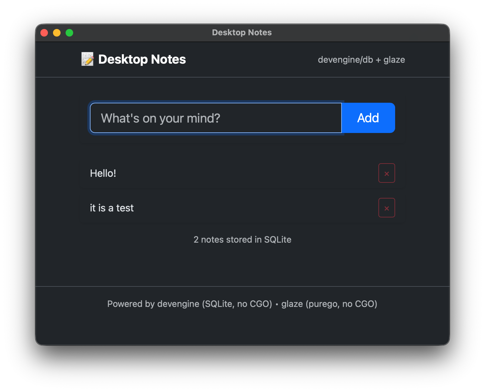

# Glaze

Glaze is a pure Go desktop WebView binding built on top of [webview/webview](https://github.com/webview/webview) and [purego](https://github.com/ebitengine/purego).

This repository started from the original `go-webview` project, but it has diverged significantly and is maintained as a separate codebase with its own goals and APIs.

## Goals

- Keep a CGo-free desktop integration layer for Go applications.
- Provide pragmatic helpers for desktop app workflows.
- Keep behavior explicit and testable.
- Stay friendly to multi-module `go.work` development.

## Key Features

- No CGo
- Windows, macOS, and Linux support
- Native library loading with embedded runtime assets
- JavaScript to Go binding support
- Utility helpers for desktop app patterns: `BindMethods`, `RenderHTML`, `AppWindow`

## Example Screenshot

Desktop example (`examples/desktop`):



## Install

```bash
go get github.com/crgimenes/glaze@latest
```

To use embedded native libraries:

```go
import _ "github.com/crgimenes/glaze/embedded"
```

## Quick Start

```go
package main

import (
	"log"

	"github.com/crgimenes/glaze"
	_ "github.com/crgimenes/glaze/embedded"
)

func main() {
	w, err := glaze.New(true)
	if err != nil {
		log.Fatal(err)
	}
	defer w.Destroy()

	w.SetTitle("Glaze")
	w.SetSize(800, 600, glaze.HintNone)
	w.SetHtml("<h1>Hello from Glaze</h1>")
	w.Run()
}
```

## Desktop Helpers

### BindMethods

`BindMethods` exports all public methods from a Go value to JavaScript names with a prefix.

```go
type Store struct{}

func (s *Store) GetItems() []string { return []string{"a", "b"} }

bound, err := glaze.BindMethods(w, "store", &Store{})
```

### RenderHTML

`RenderHTML` renders a named `html/template` to a string for `SetHtml`.

```go
html, err := glaze.RenderHTML(tpl, "page", data)
if err != nil {
	return err
}
w.SetHtml(html)
```

### AppWindow

`AppWindow` wraps an `http.Handler` in a native window and local loopback server.

```go
err := glaze.AppWindow(glaze.AppOptions{
	Title:   "My App",
	Width:   1280,
	Height:  800,
	Handler: mux,
})
```

## Running Examples

From the repository root:

```bash
go run ./examples/simple
go run ./examples/bind
```

From each example directory:

```bash
cd examples/appwindow && go run .
cd examples/desktop && go run .
cd examples/filorepl && go run .
```

## Testing

Default tests (headless safe):

```bash
go test ./...
```

GUI integration test:

```bash
go test -tags=integration -run TestWebview ./...
```

## Building on Windows

Use `windowsgui` to hide the console window:

```bash
go build -ldflags="-H windowsgui" .
```

## Project Layout

- `webview.go` - core API and binding internals
- `appwindow.go` - desktop window plus local HTTP server helper
- `helpers.go` - utility helpers (`BindMethods`, `RenderHTML`)
- `embedded/` - embedded native library assets per platform
- `examples/` - runnable sample applications

## Acknowledgments

- [abemedia/go-webview](https://github.com/abemedia/go-webview) for the original Go binding base
- [webview/webview](https://github.com/webview/webview) for the native WebView implementation
- [purego](https://github.com/ebitengine/purego) for dynamic linking without CGo
