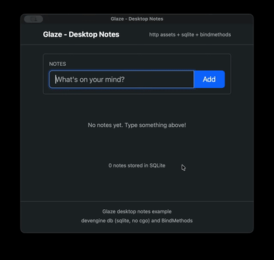
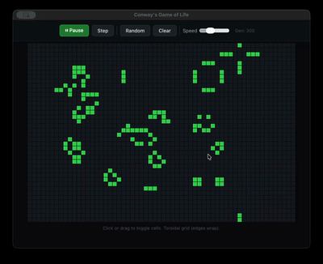
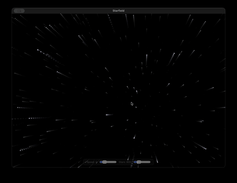
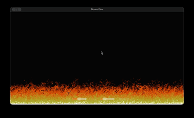
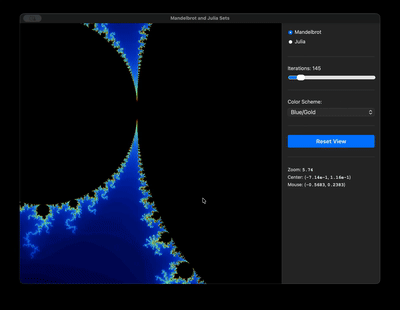
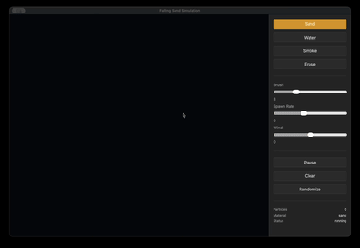
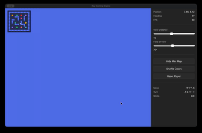
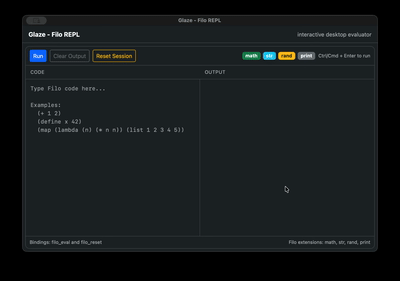

# Glaze

Glaze is a desktop WebView binding for Go. It is a pure-Go port of [webview/webview](https://github.com/webview/webview) built on [purego](https://github.com/ebitengine/purego), keeping CGo out of the picture. Each backend talks to the WebView framework the OS already ships -- WKWebView on macOS, WebKitGTK on Linux, WebView2 on Windows -- so nothing native is bundled.

It started as a fork of `go-webview` but has diverged enough to live as a separate codebase with its own goals and API.

## Why no CGo

Dragging a C toolchain into a Go project just to open a window with HTML breaks too much of what I like about the Go ecosystem -- easy cross-compilation, reproducible builds, `go install` that works for whoever clones the repo. With `purego` glaze calls the WebView framework already present on the system via dlopen / LoadLibrary, so the binary stays self-contained with no C toolchain and no bundled native library.

## What's in the box

- No CGo
- Windows, macOS, and Linux
- Zero bundled native libraries -- binds the OS WebView directly (WKWebView / WebKitGTK / WebView2)
- JavaScript to Go binding
- Helpers for common desktop patterns: `BindMethods`, `RenderHTML`, `AppWindow`
- Plays nicely with `go.work` multi-module setups

## Examples

| Desktop | Game of Life | Starfield |
| --- | --- | --- |
| [](examples/desktop/) | [](examples/gameoflife/) | [](examples/starfield/) |

| Doom Fire | Mandelbrot | Falling Sand |
| --- | --- | --- |
| [](examples/doomfire/) | [](examples/mandelbrot/) | [](examples/fallingsand/) |

| Raycasting | Filo REPL | |
| --- | --- | --- |
| [](examples/raycasting/) | [](examples/filorepl/) | |

## Install

```bash
go get github.com/crgimenes/glaze@latest
```

## Requirements

Glaze binds the WebView the operating system already provides; there is nothing to bundle, but that runtime must be present:

- **macOS** -- nothing extra. The Cocoa/WebKit frameworks ship with the OS.
- **Linux** -- a system WebKitGTK, GTK4 or GTK3; glaze detects which at runtime. The exact libraries and how to install or debug them are in [Linux shared libraries](#linux-shared-libraries) below.
- **Windows** -- the Microsoft Edge WebView2 Runtime (preinstalled on current Windows 10/11; otherwise install the Evergreen Runtime). It is located via the registry, and `New` returns an error if it is missing. To bundle zero native DLLs, glaze calls the runtime's internal environment-creation export directly instead of shipping `WebView2Loader.dll`; that export is undocumented and could change in a future Edge runtime (in which case `New` returns a clear error). See the note on `createEnvironment` in [webview2_windows.go](webview2_windows.go).

### Linux shared libraries

Linux is the hard case. Every distro packages WebKitGTK a little differently and glaze can't paper over all of it -- but what it needs is concrete. These are the exact sonames it tries to `dlopen` at startup. They have to be loadable by the dynamic linker (on the default search path or in the `ldconfig` cache, or in `LD_LIBRARY_PATH`) and the **same architecture as your binary** -- a 64-bit Go build needs 64-bit libraries.

Always loaded:

- `libglib-2.0.so.0`
- `libgobject-2.0.so.0`

`libwebkitgtk-6.0.so.4` decides the stack: if it loads, glaze uses GTK4; otherwise GTK3. It never loads both -- most desktops have GTK3 and GTK4 installed side by side, and pulling both into one process corrupts GTK's type system and crashes `gtk_init`.

- GTK4: `libgtk-4.so.1`, `libwebkitgtk-6.0.so.4`, `libjavascriptcoregtk-6.0.so.1`
- GTK3: `libgtk-3.so.0`, `libwebkit2gtk-4.1.so.0` (or `libwebkit2gtk-4.0.so.37`), `libjavascriptcoregtk-4.1.so.0` (or `libjavascriptcoregtk-4.0.so.18`)

Installing the WebKitGTK package pulls GTK and GLib in as dependencies:

- Debian / Ubuntu: `apt install libwebkit2gtk-4.1-0` (GTK3) or `libwebkitgtk-6.0-4` (GTK4)
- Fedora: `dnf install webkit2gtk4.1` or `webkitgtk6.0`
- Arch: `pacman -S webkit2gtk-4.1` or `webkitgtk-6.0`
- Nix / NixOS: these libraries are not on the default loader path, so a bare `go run` outside a shell that provides them fails to load. Add `webkitgtk_4_1` (or `webkitgtk_6_0`) to your `buildInputs` / dev shell, or expose them through `LD_LIBRARY_PATH` or `nix-ld`.

If `New` returns `webview: none of [...] could be loaded`, the linker can't find that soname. See what's actually visible to it:

```bash
ldconfig -p | grep -E 'libwebkit(2)?gtk|libjavascriptcoregtk|libgtk-[34]'
```

`wrong ELF class: ELFCLASS32` means the library was found but in the wrong architecture -- a 64-bit binary was pointed at 32-bit libraries (check your `LD_LIBRARY_PATH`).

The test suite reflects this: the GUI tests skip themselves when none of these libraries can load, so `go test ./...` stays green on a box without WebKitGTK instead of failing.

## Hello world

```go
package main

import (
	"log"

	"github.com/crgimenes/glaze"
)

func main() {
	w, err := glaze.New(true)
	if err != nil {
		log.Fatal(err)
	}
	defer w.Destroy()

	w.SetTitle("Glaze")
	w.SetSize(800, 600, glaze.HintNone)
	w.SetHtml("<h1>Hello from Glaze</h1>")
	w.Run()
}
```

Glaze pins the goroutine that creates the first window to its current OS thread. Keep direct window calls on that goroutine, and use `Dispatch` to re-enter the UI thread from background work.

## Desktop helpers

### BindMethods

A convenience layer over `Bind` that exposes every exported method of a Go value as a JavaScript-callable function.

What it does:

- Reflects over the exported methods of a struct or pointer receiver.
- Builds JavaScript names with a prefix and snake_case conversion.
  - Example: `GetUserByID` with prefix `api` becomes `api_get_user_by_id`.
- Applies the same signature rules as `Bind`: no return, value, error, value and error.
- Returns the list of registered names so you can log or verify them.

Useful when you have a service object and want to expose a consistent JavaScript API without writing one `Bind` call per method.

```go
type Store struct{}

func (s *Store) GetItems() []string { return []string{"a", "b"} }

bound, err := glaze.BindMethods(w, "store", &Store{})
```

### RenderHTML

Renders a named Go `html/template` to a string you can pass to `SetHtml`.

What it does:

- Runs a specific template (nested calls included).
- Returns the final HTML string.
- Wraps execution errors with template context.

Useful when you want server-style template rendering in a local desktop app without running an HTTP server for that page.

```go
html, err := glaze.RenderHTML(tpl, "page", data)
if err != nil {
	return err
}
w.SetHtml(html)
```

### AppWindow

Wraps an `http.Handler` inside a native desktop window backed by a local loopback HTTP server.

What it does:

- Selectable transport with platform-aware default:
  - `auto` (default): `unix` on macOS/Linux, `tcp` on Windows
  - `tcp`: direct loopback HTTP (`127.0.0.1`)
  - `unix`: handler served on a Unix socket with a lightweight loopback HTTP gateway for browser navigation
- Starts listeners on random free ports/paths by default (or a custom `Addr` / `UnixSocketPath`).
- Creates a native window and navigates it to that local URL.
- Runs the UI loop and shuts down the HTTP server when the window exits.
- Supports window sizing, title, debug mode, and an optional readiness callback.
  - `OnReady` receives the browser URL (always `http://127.0.0.1:...`).
  - `OnReadyInfo` receives the resolved backend details (`Transport`, `Backend`, `Gateway`) so you can verify unix vs tcp from logs.

The shortest path from an existing `net/http` app to a desktop app, with minimal changes to routing, templates, and assets.

```go
err := glaze.AppWindow(glaze.AppOptions{
	Title:     "My App",
	Width:     1280,
	Height:    800,
	Transport: glaze.AppTransportAuto,
	Handler:   mux,
	OnReadyInfo: func(info glaze.AppReadyInfo) {
		log.Printf("transport=%s backend=%s gateway=%s", info.Transport, info.Backend, info.Gateway)
	},
})
```

## Running the examples

From the repository root:

```bash
go run ./examples/simple
go run ./examples/bind
go run ./examples/zero_tcp
```

From each example directory:

```bash
cd examples/appwindow && go run .
cd examples/desktop && go run .
cd examples/filorepl && go run .
```

`examples/zero_tcp` shows a local-first UI built with `SetHtml + BindMethods` only -- no HTTP server, no loopback TCP gateway.

## Testing

```bash
go test ./...
```

This runs the pure-logic unit tests (binding marshalling, transport selection)
plus the per-platform GUI smoke tests, which drive a real WebView
(WKWebView / WebKitGTK / WebView2). Those GUI tests **skip themselves** when the
system WebView can't run here -- no display, or the libraries aren't installed
(WebKitGTK on Linux, the Edge WebView2 Runtime on Windows) -- so the command
above stays green on a headless or minimal box instead of failing.

To actually exercise the GUI tests on Linux, install WebKitGTK and run under a
virtual display:

```bash
xvfb-run -a go test ./...
```

## Building on Windows

Use `windowsgui` to hide the console window:

```bash
go build -ldflags="-H windowsgui" .
```

## Project layout

- `webview_common.go` -- the `WebView` interface, function-wrapper, and JS marshalling
- `webview_bridge.go` / `webview_bridge_webkit.go` -- the injected JS bridge (init/bind scripts)
- `webview_darwin.go` / `webview_linux.go` / `webview_windows.go` (+ `webview2_windows.go`, `putbounds_amd64.go`, `putbounds_arm64.go`) -- the per-OS pure-Go backends
- `appwindow.go` -- desktop window + local HTTP server helper
- `helpers.go` -- utility helpers (`BindMethods`, `RenderHTML`)
- `examples/` -- runnable sample applications (their own Go module)

Glaze loads the OS WebView framework directly and bundles or extracts no native library, so there is no extracted file to verify or swap.

## Acknowledgments

- [abemedia/go-webview](https://github.com/abemedia/go-webview) for the original Go binding base
- [webview/webview](https://github.com/webview/webview) for the original C++ WebView implementation this is ported from
- [purego](https://github.com/ebitengine/purego) for dynamic linking without CGo
